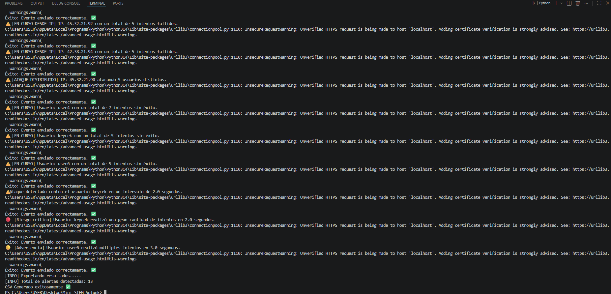
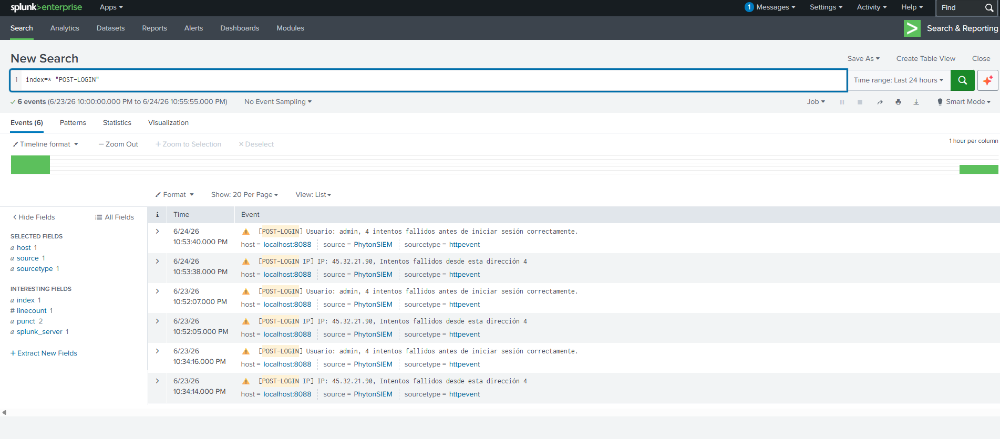
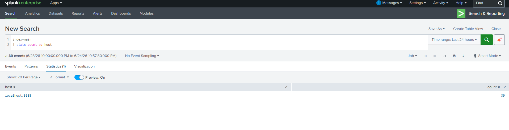

# Mini SIEM con integración a Splunk


## Descripción

Mini SIEM desarrollado en Python para la detección y análisis de eventos de autenticación sospechosos a partir de registros de logs.

El proyecto permite identificar patrones de fuerza bruta, ataques distribuidos, múltiples  intentos fallidos de autenticación y actividades anómalas basadas en ventanas de tiempo. Además integra el envío de eventos a Splunk mediante HTTP Event Collector (HEC) para su visualización y análisis.


## Objetivo del proyecto

Este proyecto fue desarrollado como práctica personal de programación en Python, aprendizaje de conceptos básicos de un SIEM y familiarización con Splunk como plataforma de análisis y visualización de eventos de seguridad. Su objetivo es fortalecer habilidades relacionadas con:

- Procesamiento y análisis de logs.
- Detección de eventos de seguridad.
- Correlación básica de eventos.
- Exportación de alertas.
- Integración con Splunk mediante HEC
- Desarrollo de proyectos prácticos orientados a ciberseguridad.

## Características 

- Lectura y procesamiento de archivos de logs.
- Interpretación y validación de eventos.
- Detección de múltiples intentos fallidos por usuario.
- Detección de múltiples intentos fallidos por dirección IP.
- Detección de ataques distribuidos contra varios usuarios.
- Correlación de eventos basada en tiempo.
- Clasificación de alertas por nivel de riesgo.
- Exportación de resultados a archivos TXT y CSV.
- Integración con Splunk mediante HEC.

## Estructura del proyecto 

- config.py -> Configuración general del proyecto.
- Lector_logs.py -> Lectura de archivos de logs.
- interpretar_datos.py -> Interpretación y validación de eventos.
- deteccionp.py -> Motor de detección y correlación.
- exportar.py -> Exportación de alertas a TXT y CSV.
- transmitir_splunk.py -> Envío de eventos a Splunk HEC.
- mainp.py -> Punto de entrada principal.

## Tecnologías utilizadas

- Python 3
- Splunk Enterprise
- HTTP Event Collector (HEC)


## Capturas de pantalla


### Ejecución del proyecto



### Alertas recibidas en Splunk


### Estadísticas en Splunk



## Configuración de Splunk
En el archivo config.py se debe reemplazar el valor:

```python
TOKEN_HEC = "AQUI TU TOKEN HEC"
```

Por el token generado en la instancia local de Splunk

La URL utilizada como ejemplo corresponde a un entorno local:

```python
URL_HEC = "https://localhost:8088/services/collector"
```
## Autor 
Anderson Marín López 

